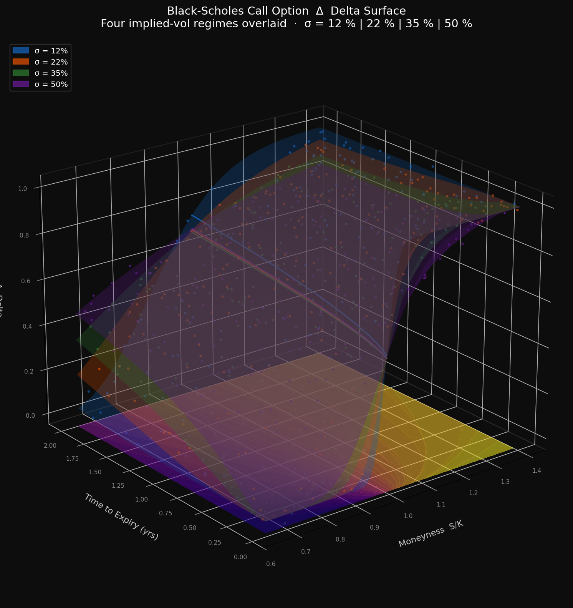

# Options Delta Surface

A deliberately hard-to-read 3D visualization of Black-Scholes call option delta across four implied-volatility regimes.



## What it shows

- **X axis** — Moneyness (S/K): deep ITM (0.65) → deep OTM (1.40)
- **Y axis** — Time to expiry: 2 weeks → 2 years
- **Z axis** — Delta (0 → 1)
- **Four overlapping surfaces** — σ = 12%, 22%, 35%, 50%

## Why it's hard to read

| Problem | Effect |
|---|---|
| Four semi-transparent surfaces overlap | Colors mix; you can't isolate a single vol regime by eye |
| 3D perspective distortion | Exact delta values are unreadable without a grid reference |
| Projected contours on the floor | Uses a different (plasma) color scale — can't be correlated to surface height |
| Jittered scatter points | Float ambiguously; unclear if above or below a given surface |
| Transparency + dark background | Legend colors don't match what the renderer actually produces |

## Run it yourself

```bash
pip install matplotlib numpy scipy
python delta_surface.py
```

Output: `delta_surface.png` (160 dpi)

## Dependencies

- Python 3.8+
- `matplotlib`
- `numpy`
- `scipy`
